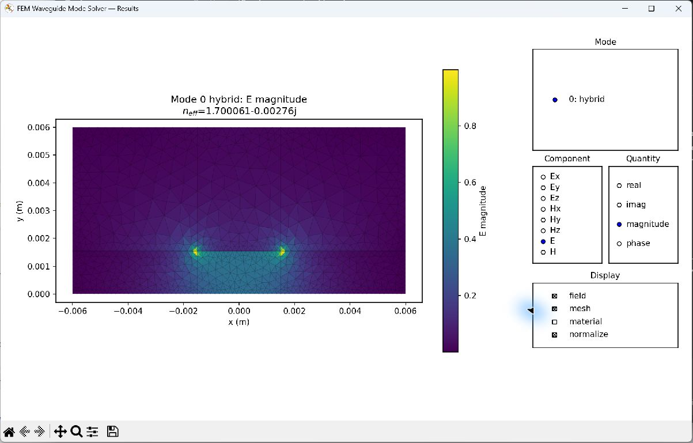

# FDFD v1.0.0

FDFD v1.0.0 intentionally uses simplified Python syntax to make
electromagnetic calculations easier to set up and explore. Define a solver, define
reusable materials, add geometry, mesh, solve, and inspect the results in a GUI.
You can change field components, modes, and display options without writing a new
plotting script for each view.

Version 1.0.0 provides independently installable FDFD and FEM solver families and
separately built native applications. See the [release history](doc/development/release_history.md)
for changes since the earlier FDFD releases.

| Method | Problem | Package | Usage guide | API reference |
|---|---|---|---|---|
| FDFD | waveguide modes | `fdfd_waveguide_modes` | [Guide](doc/solvers/fdfd/waveguide_modes/guide.rst) | [API](doc/solvers/fdfd/waveguide_modes/API_REFERENCE.rst) |
| FDFD | periodic modes | `fdfd_periodic_modes` | [Guide](doc/solvers/fdfd/periodic_modes/guide.rst) | [API](doc/solvers/fdfd/periodic_modes/API_REFERENCE.rst) |
| FDFD | band structure | `fdfd_band_structure` | [Guide](doc/solvers/fdfd/band_structure/guide.rst) | [API](doc/solvers/fdfd/band_structure/API_REFERENCE.rst) |
| FDFD | scattering | `fdfd_scattering` | [Guide](doc/solvers/fdfd/scattering/guide.rst) | [API](doc/solvers/fdfd/scattering/API_REFERENCE.rst) |
| FEM | waveguide modes | `fem_waveguide_modes` | [Guide](doc/solvers/fem/waveguide_modes/guide.rst) | [API](doc/solvers/fem/waveguide_modes/API_REFERENCE.rst) |
| FEM | periodic modes | `fem_periodic_modes` | [Guide](doc/solvers/fem/periodic_modes/guide.rst) | [API](doc/solvers/fem/periodic_modes/API_REFERENCE.rst) |
| FEM | waveguide scattering | `fem_waveguide_scattering` | [Guide](doc/solvers/fem/waveguide_scattering/guide.rst) | [API](doc/solvers/fem/waveguide_scattering/API_REFERENCE.rst) |
| FEM | electrostatics | `fem_electrostatics` | [Guide](doc/solvers/fem/electrostatics/guide.rst) | [API](doc/solvers/fem/electrostatics/API_REFERENCE.rst) |

Waveguide scattering is **2.5D full-vector** physics on a 2D mesh. Electromagnetic solvers use `exp(+i*omega*t)`; passive material loss has a nonpositive imaginary part.

```text
solvers/      Independently installable Python FDFD and FEM families
examples/     Runnable tutorials organized by method and solver family
apps/         Native viewers and transmission-line calculator
libraries/    Shared CEM API, FEM adaptivity, and periodic eigensolver
doc/          Central user guides, API references, and contributor documentation
tests/        Solver, library, regression, and integration checks
benchmarks/   Numerical performance and convergence studies
tools/        User grid and PML calculators
scripts/      Development, build, and release tooling
outputs/      Ignored generated files
```

## Installation

Create the project environment from the repository root:

```sh
conda env create -f environment.yml
conda activate cem
python scripts/install_python.py --editable
python -m pytest
```

Installation and run scripts use the active Python interpreter. An existing environment with the required dependencies also works.

If you already have a development environment, activate it and run the installation
step from the repository root. Repeat this after moving or reorganizing the checkout;
old editable installations still point to their previous directories:

```sh
python scripts/install_python.py --editable --no-build-isolation
```

`--no-build-isolation` uses the build dependencies already present in the environment
(including setuptools, Cython, and NumPy, as listed in `environment.yml`). Omit it to
let pip provision isolated build dependencies.

## Quick start

The general workflow is:

```text
Define solver → Define materials → Add geometry → Mesh → Solve → Show results
```

A small 10 GHz copper microstrip example follows. All lengths are in metres;
`epsilon` is relative permittivity. This model uses a finite PEC enclosure, an
air background, a lossy substrate, and copper surface-impedance boundaries.

```python
from cem_common import Material, materials
from fem_waveguide_modes import ModeSolver2D

# 1. Define the solver and its physical domain.
x_range = (-6e-3, 6e-3)
solver = ModeSolver2D(
    frequency=10e9, x_range=x_range, y_range=(-35e-6, 6e-3),
    background_material=materials.air, boundary=materials.PEC,
)

# 2. Define materials; copper is a built-in good-conductor SIBC preset.
substrate = Material(name="microwave laminate", epsilon=3.55 * (1 - 0.0027j))
copper = materials.copper

# 3. Assign materials to the substrate, ground plane, and strip.
solver.add_rectangle(x_range=x_range, y_range=(0, 1.524e-3), material=substrate)
solver.add_rectangle(x_range=x_range, y_range=(-35e-6, 0), material=copper)
solver.add_rectangle(
    x_range=(-1.5e-3, 1.5e-3), y_range=(1.524e-3, 1.559e-3), material=copper,
)

# 4. Mesh, solve for one mode, and open the interactive results viewer.
solver.mesh(max_element_size=0.6e-3, wavelength_elements=10, material_aware=True)
result = solver.solve(num_modes=1, neff_guess=1.65, max_refinements=0)
solver.show()
```

In the GUI, select **E**, **magnitude**, **mesh**, and **normalize** to obtain
the view below. The field is strongest near the strip edges, where the mesh is
also finer. The example gives approximately `neff = 1.7001 - 0.00276j`;
the negative imaginary part represents passive forward attenuation.



*Actual viewer screenshot from the [copper microstrip example](examples/fem/waveguide_modes/microstrip_2d_surface_impedance.py).
Copper interiors are excluded from the mesh. Field amplitudes are normalized
for display; this is an eigenmode calculation, not an applied-voltage simulation.*

Run the complete example after installation:

```sh
python examples/fem/waveguide_modes/microstrip_2d_surface_impedance.py
```

`solver.show()` and `result.show()` open interactive GUIs. Waveguide modes and
electrostatics use Matplotlib; FEM periodic modes and waveguide scattering use
the separately built native viewers. For a static figure, use
`figure = result.plot(component="E", quantity="magnitude", mode=0)` and
`figure.savefig("microstrip.png")`. The [solver guides](doc/README.rst) explain
the available controls and physics-specific operations.

The `src/` packages must be installed before running examples. Once installed in
the same Python environment, examples work from their own directories too:

```sh
cd examples/fem/electrostatics
python embedded_electrode_2d_anisotropic.py
```

If an example reports `ModuleNotFoundError`, check `python -m pip list --editable`
and rerun the installation command with that same interpreter.

Meshing can be automatic; geometry changes invalidate the current mesh and result.
Solves do not open windows or save files. Use `result.save(path)` and the family’s
`load_result(path)` to inspect a completed result later without solving again.
The example selects a fixed mesh with `max_refinements=0`; FEM solves otherwise
default to up to two adaptive refinements. See the [example index](examples/README.rst)
for runnable tutorials and their recommended order.

Example names follow `<physical_problem>_<dimension>[_<feature>].py`. Scripts that
save results write under `outputs/examples/<method>/<family>/<example>/`, regardless
of the working directory. Postprocessing scripts read those results by default and
also accept an explicit input path. Python packages remain independently installable;
the tutorial collection lives in the checkout.

All FEM archives use `cem-fem-results` schema `1.0`, with physical units, field representation, and convention metadata. Loaded results support inspection rather than solver restart. Old imports, scattering phasors, and archive formats have no compatibility layer.

## Native applications

Build the native applications after installing Qt 6, HDF5, Eigen, Gmsh, and FTXUI; the periodic viewer also supports VTK:

```sh
cmake -S . -B outputs/build -G Ninja -DCMAKE_BUILD_TYPE=Release
cmake --build outputs/build --parallel
ctest --test-dir outputs/build --output-on-failure
```

- [FEM Waveguide Scattering Viewer](apps/fem_waveguide_scattering_viewer/README.rst)
- [FEM Periodic Mode Viewer](apps/fem_periodic_mode_viewer/README.rst)
- [Transmission Line Calculator](apps/transmission_line_calculator/README.rst)

## Testing and release checks

Python tests live under `tests/fdfd/`, `tests/fem/`, and `tests/libraries/`;
cross-family tests remain directly under `tests/`. Run `python -m pytest` for all
Python tests, or select a family such as `python -m pytest tests/fem/electrostatics`.
Native C++ tests remain with their CMake applications.

Build and qualify Python release artifacts with:

```sh
python scripts/build_wheels.py
python scripts/qualify_wheels.py
python scripts/check_documentation.py
python scripts/qualify_examples.py
python scripts/qualify_native.py
```

Wheel qualification installs every package outside the checkout and checks the compiled eigensolver. Example qualification runs every solver example with viewer launches suppressed. Native qualification checks Python-written archives in the inspectors and offscreen viewers. Published changes are recorded in the [release history](doc/development/release_history.md).

The [documentation index](doc/README.rst) contains all Python solver and library
guides and API references. Package READMEs are short navigation pages retained
for independent wheel metadata.

Shared library guides: [materials, shapes, and errors](doc/libraries/cem_common/guide.rst),
[FEM adaptivity](doc/libraries/fem_adaptivity/guide.rst), and
[periodic eigensolver](doc/libraries/periodic_eigensolver/guide.rst).


## Python native eigensolver

The optional Cython extension speeds up the shared periodic eigensolver. A source
installation requires a compiler compatible with the active Python ABI; official
Windows CPython normally uses MSVC. Cython, NumPy, SciPy, and setuptools build
dependencies are included in `environment.yml`. Without a compiler, a source
install can use the NumPy/SciPy fallback. A release binary wheel must contain the
extension; `scripts/build_wheels.py` enforces that requirement.

Check the active environment with:

```sh
python -c "from periodic_eigensolver import native_backend_available; print(native_backend_available())"
```

The extension uses SciPy's BLAS implementation. If a source install fell back to
Python and native acceleration is wanted, configure a compatible compiler and
rerun `python scripts/install_python.py --editable --no-build-isolation`.

## Analytical benchmarks

The [benchmark index](benchmarks/README.md) provides executable comparisons of
solver results with analytical waveguide and electrostatic solutions. These save
numerical error tables and plots under `outputs/benchmarks/analytical/`.
