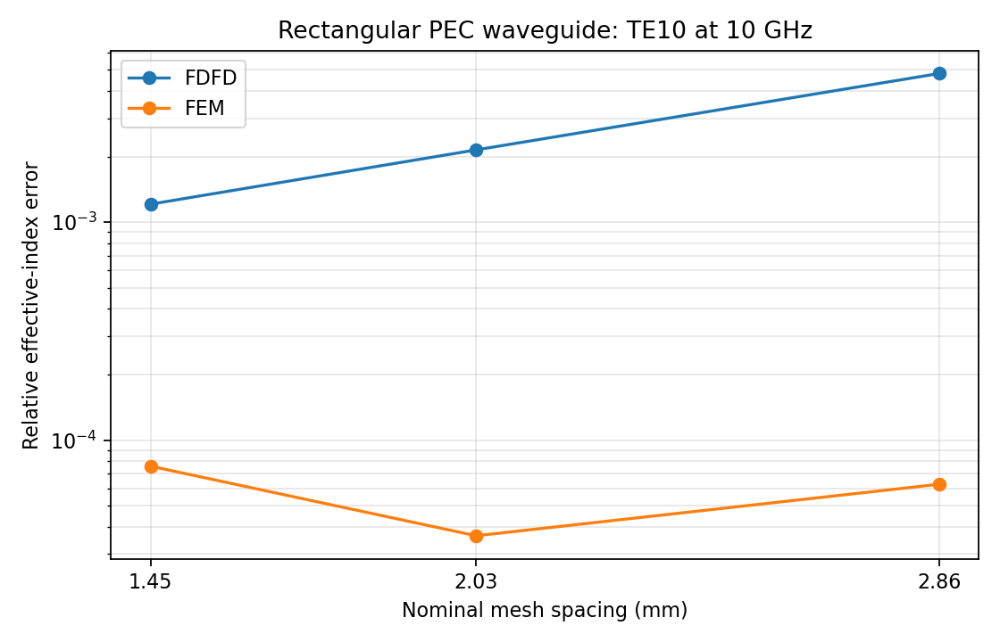
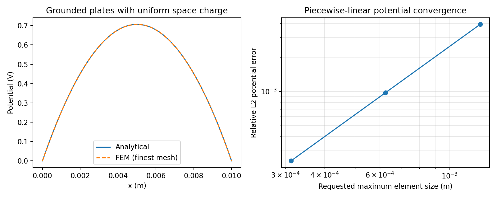
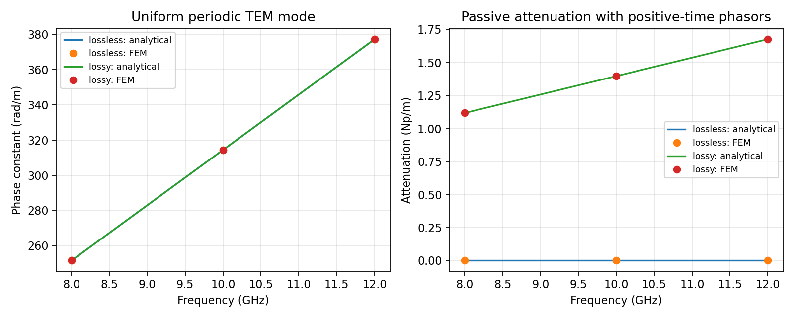
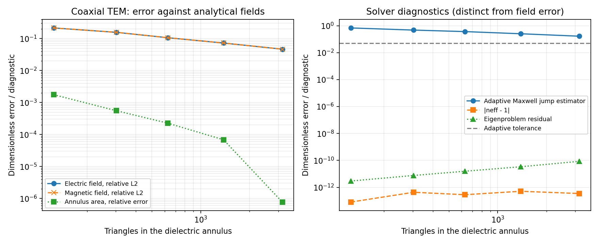
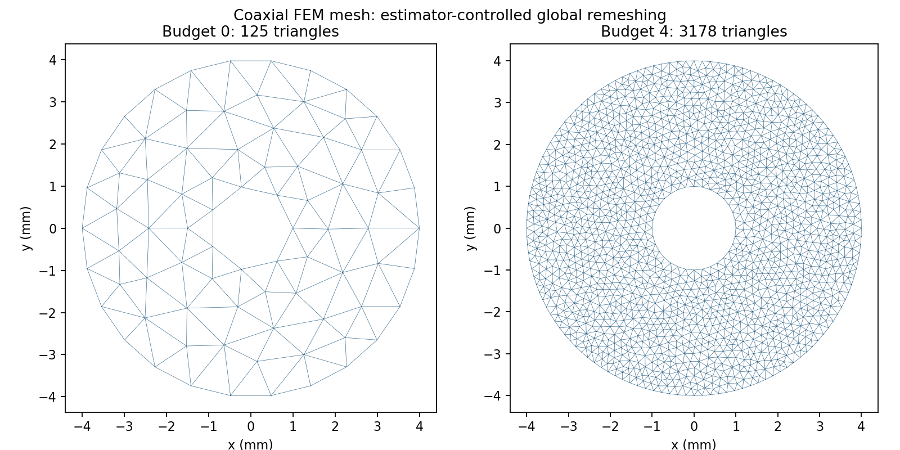

# Checked analytical benchmark results

These plots and CSV tables are intentionally tracked in Git. They are snapshots
of successful `--check` runs, not files generated automatically during testing.
The [benchmark guide](../README.md) explains the analytical solutions, units,
mesh choices, and acceptance criteria. The [manifest](manifest.json) records
commands, dependency versions, the base Git revision, whether the source tree was
modified, a combined source hash, and individual artifact hashes. Timings are
observations on that environment, not portable performance requirements.

To reproduce and refresh every reference from the repository root:

```console
python scripts/update_benchmark_references.py
```

The script first runs all four analytical checks into ignored `outputs/`, then
copies their reports here only if all checks succeed. Review the changed plots
and tables before committing them. Normal individual benchmark runs do not
overwrite these references.

## Rectangular PEC waveguide

[Data](rectangular_waveguide_modes/comparison.csv): FDFD/FEM TE10 effective index
against theory. FEM uses independent, nonnested meshes.



## Parallel-plate electrostatics

[Error/capacitance data](parallel_plate_electrostatics/comparison.csv) and
[potential samples](parallel_plate_electrostatics/potential.csv): linear capacitor
potential and quadratic space-charge potential, compared with FEM.



## Uniform periodic medium

[Data](uniform_periodic_medium/comparison.csv): lossless and lossy TEM phase and
attenuation compared with the complex-index analytical solution.



## Coaxial TEM adaptive refinement

[Error data](coaxial_waveguide_adaptivity/comparison.csv) and
[adaptive histories](coaxial_waveguide_adaptivity/adaptive_history.csv): field errors
decrease while the effective index is already near roundoff. The default four
refinements exhaust the budget before reaching the estimator tolerance. Refinement
is currently global, controlled by the estimator.




